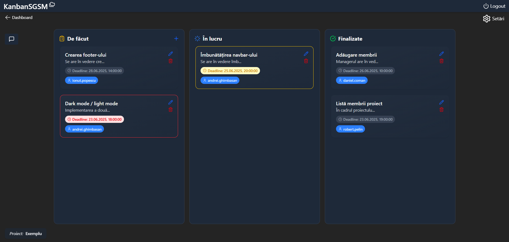
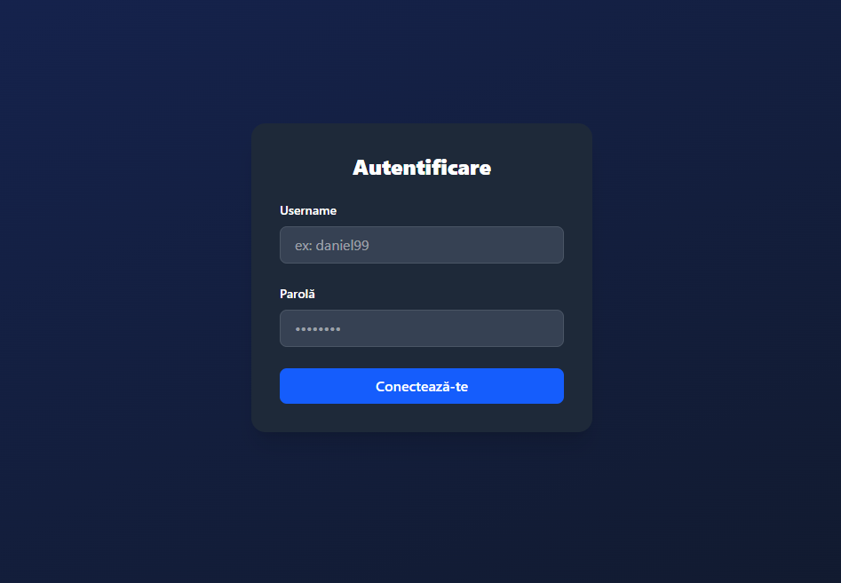
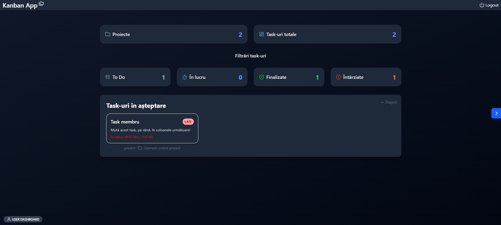
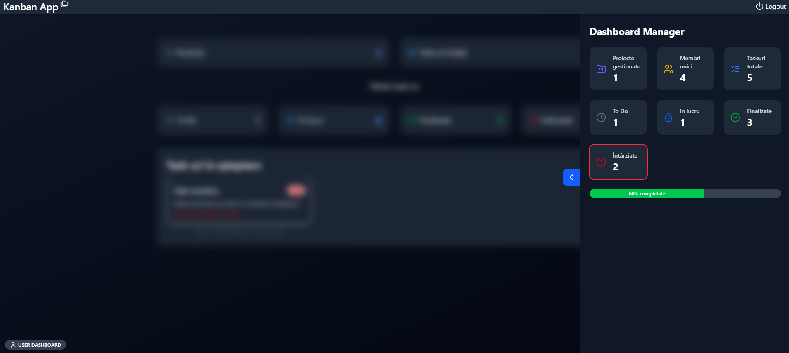

# **Kanban Project Management App**

A full-stack **Kanban-style project management application** designed to help teams organize projects, manage tasks, and collaborate efficiently.

---

## **Features**

- Secure **JWT-based authentication**  
- **Role-based access**: Managers can create/edit projects & tasks; users can update task statuses  
- **Interactive Kanban board** with drag-and-drop  
- Task attributes: title, description, deadline, assigned user
- Project member management and comments (with pinned messages)  

---

## Screenshots

### Kanban Board


### Login Page


### Dashboard User


### Dashboard Manager


---

## **Tech Stack**

- **Frontend**: React + TypeScript, TailwindCSS, @hello-pangea/dnd, custom `fetch` wrapper for API calls etc.  
- **Backend**: Spring Boot (Java 21), Spring Security (JWT), Spring Data JPA, PostgreSQL, JUnit (testing)  

---

## **Setup**

### **1. Backend**
- Configure PostgreSQL in `application.properties`
- ! Manually insert at least one admin/manager account in the database before first login
- Run:
```bash
cd backend
./mvnw spring-boot:run
```
- Available at **http://localhost:8080**

### **2. Frontend**
- Install dependencies & start:
```bash
cd frontend
npm install
npm run dev
```
- Available at **http://localhost:5173**
